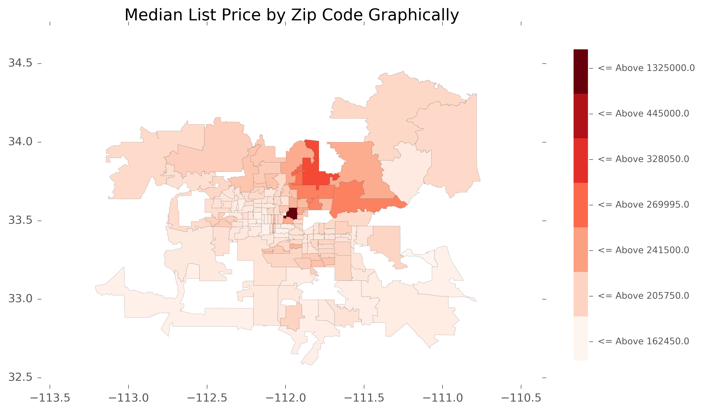

Introduction
------------
This is a lean version of house market analysis I did.
Due to copyright, the raw data set is not allowed to be published.

Environment
-----------
Python 2.7.10. with IPython

Installation
------------
The packages needed:
- `numpy`
- `pandas`
- `matplotlib`
- `shapely`
- `ast`
- `datetime`
- `PIL`
- `shapefile`
- `mpl_toolkits.basemap`
- `descartes`
- `pysal.esda.mapclassify`
- `statsmodels.api`

Example
-------
For Phoenix Area:

Reference
--------- 
Stephan Hügel
`https://gist.github.com/urschrei/6436526#file-london_from_shp-png`
